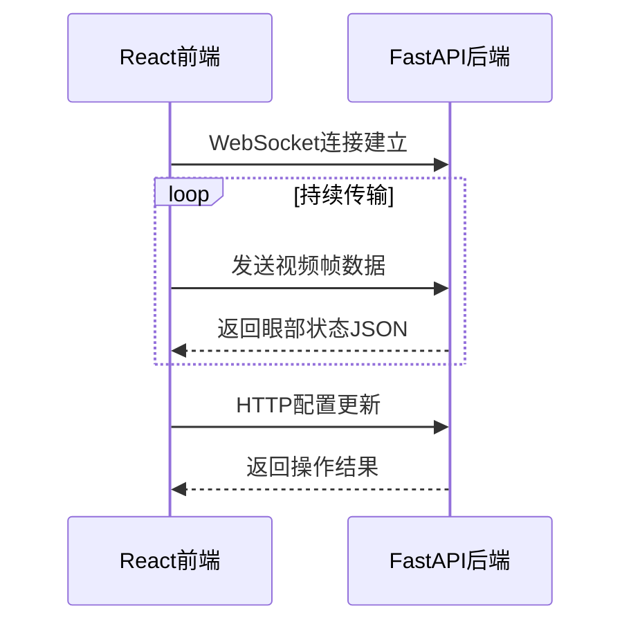

# 项目说明
## 启动方法
### 首次启动
1. 激活虚拟环境
```
source venv/bin/activate
```
2. 安装依赖
```
pip install -r backend/requirements.txt
npm install
cd frontend
npm install
```
### 后续启动
```
npm start
```

## 开发日志
- 2025.1.2
使用```electron-vite-react```脚手架搭建项目
- 2025.1.3
写了摄像头组件的demo，并用于采集数据
- 2025.1.5
通过antd的Layout组件搭建主要布局
- 2025.1.6
更新路由管理
- 2025.1.10
稍微完善了CameraCapture组件，加入状态控制；
websocket传输视频流数据；
后续考虑更改为全局状态控制，
- 2025.2.5
更改项目结构，集成FastApi后端，使用electron作为桥阶层，前端改用更轻量的vite脚手架

后续考虑变更布局


主要功能数据传输结构：



视频流处理队列架构


图像编码处理可能的解决
```python
def process_base64_image(base64_str: str) -> np.ndarray:
    """处理前端发送的Base64图像数据"""
    try:
        # 分离数据头
        if "," not in base64_str:
            raise ValueError("Invalid base64 format")
        header, data = base64_str.split(",", 1)
        
        # Base64解码
        img_bytes = base64.b64decode(data)
        nparr = np.frombuffer(img_bytes, dtype=np.uint8)
        
        # OpenCV解码
        img = cv2.imdecode(nparr, cv2.IMREAD_COLOR)
        if img is None:
            raise ValueError("Failed to decode image")
            
        # 格式转换
        rgb_img = cv2.cvtColor(img, cv2.COLOR_BGR2RGB)
        
        # 尺寸调整
        if rgb_img.shape != (450, 450, 3):
            rgb_img = cv2.resize(rgb_img, (450, 450))
            
        return rgb_img
        
    except Exception as e:
        print(f"图像处理失败: {str(e)}")
        raise
```
# React + TypeScript + Vite

This template provides a minimal setup to get React working in Vite with HMR and some ESLint rules.

Currently, two official plugins are available:

- [@vitejs/plugin-react](https://github.com/vitejs/vite-plugin-react/blob/main/packages/plugin-react/README.md) uses [Babel](https://babeljs.io/) for Fast Refresh
- [@vitejs/plugin-react-swc](https://github.com/vitejs/vite-plugin-react-swc) uses [SWC](https://swc.rs/) for Fast Refresh

## Expanding the ESLint configuration

If you are developing a production application, we recommend updating the configuration to enable type aware lint rules:

- Configure the top-level `parserOptions` property like this:

```js
export default {
  // other rules...
  parserOptions: {
    ecmaVersion: 'latest',
    sourceType: 'module',
    project: ['./tsconfig.json', './tsconfig.node.json'],
    tsconfigRootDir: __dirname,
  },
}
```

- Replace `plugin:@typescript-eslint/recommended` to `plugin:@typescript-eslint/recommended-type-checked` or `plugin:@typescript-eslint/strict-type-checked`
- Optionally add `plugin:@typescript-eslint/stylistic-type-checked`
- Install [eslint-plugin-react](https://github.com/jsx-eslint/eslint-plugin-react) and add `plugin:react/recommended` & `plugin:react/jsx-runtime` to the `extends` list
